## Project Name

YelpTinder2.0

An application used to connect users with local businesses, built with React Native, JavaScript, and CSS.

## Project Screen Shots

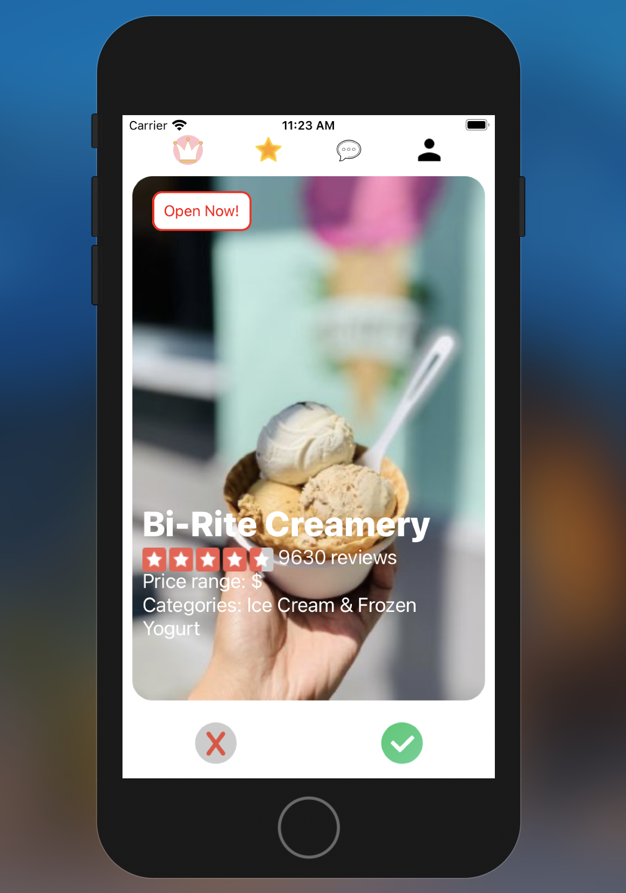
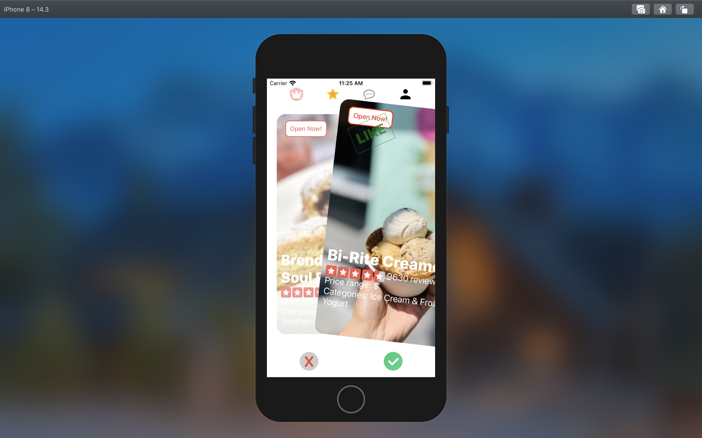
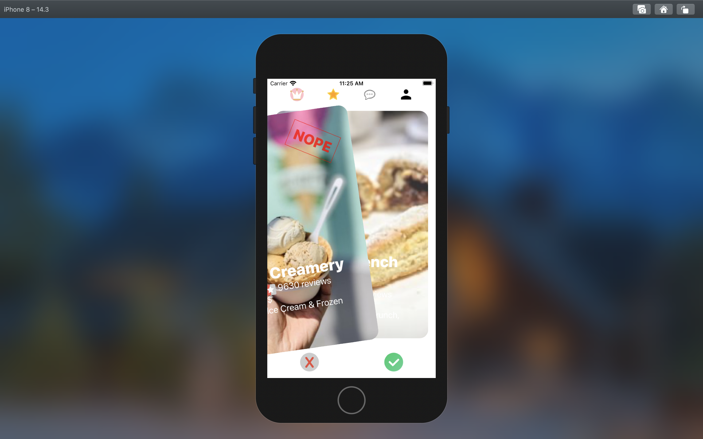
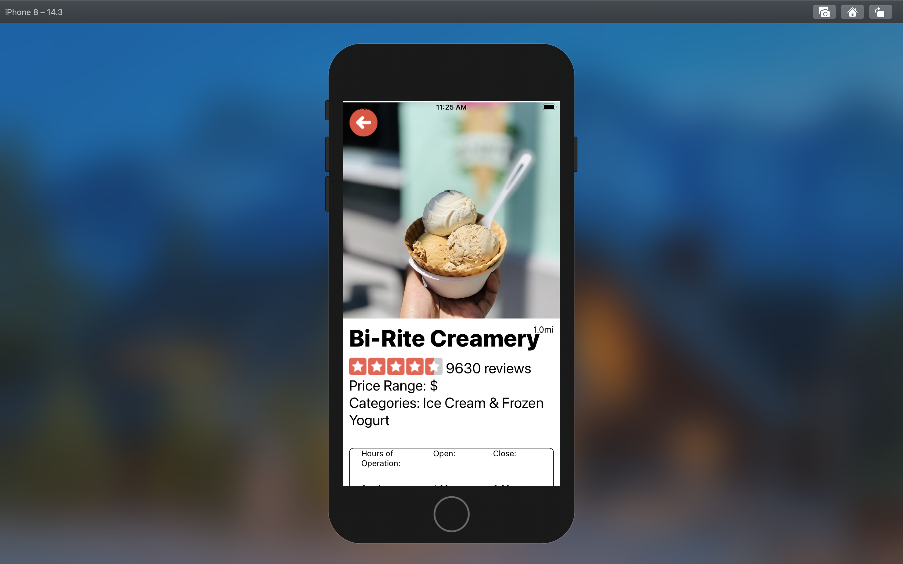
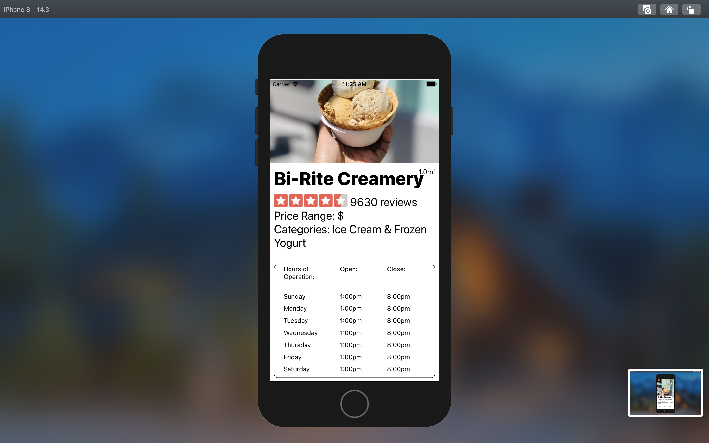
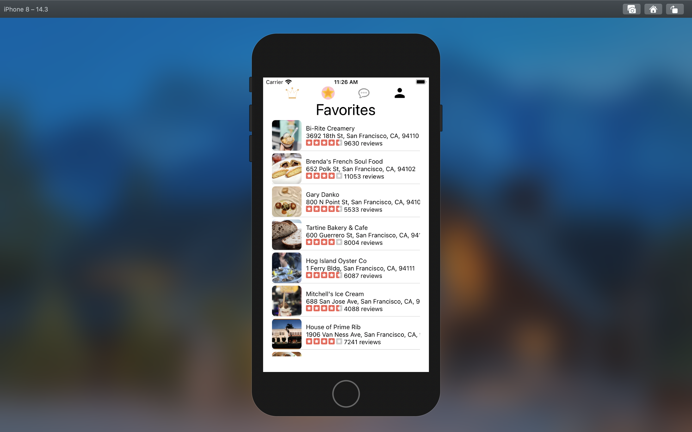
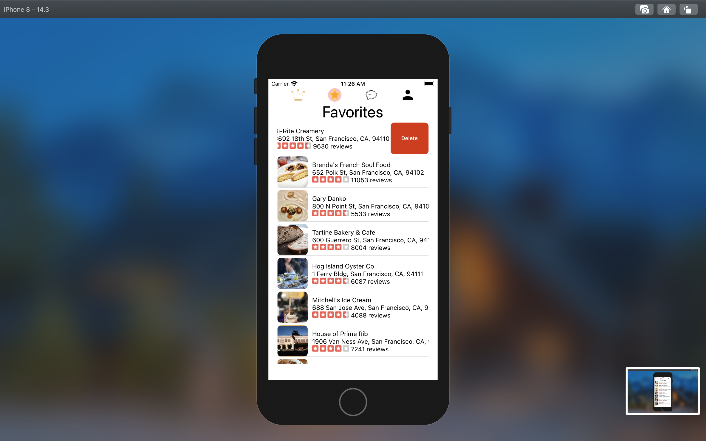
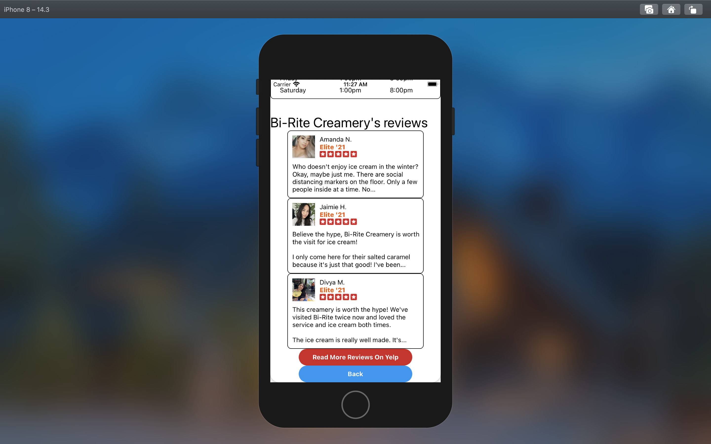
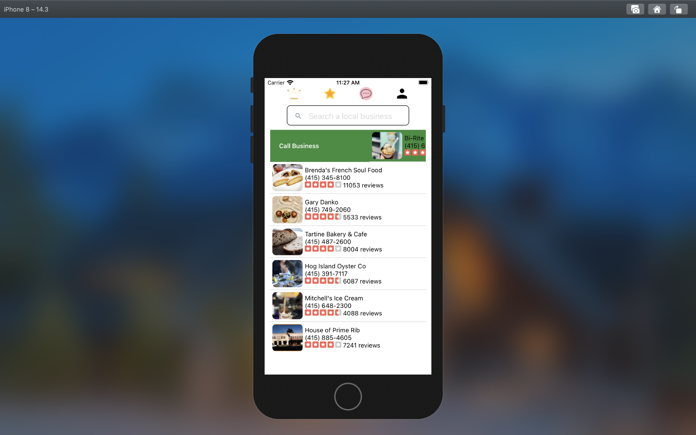
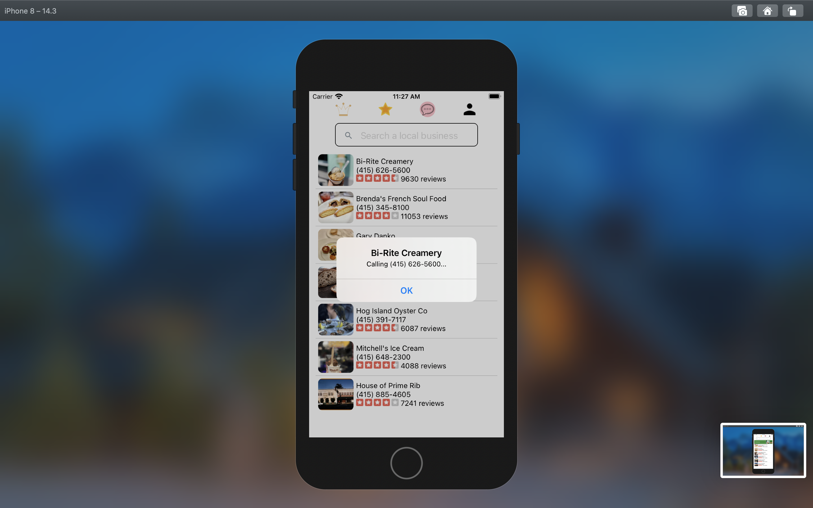
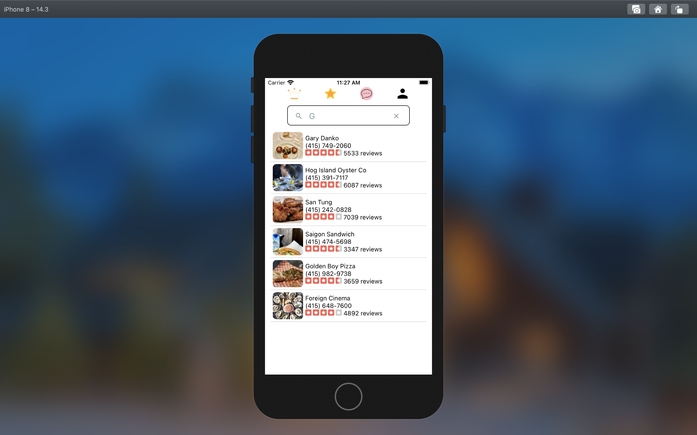

## Installation and Setup Instructions

Clone down this repository. You will need `node` and `npm` installed globally on your machine. Xcode iOS or Android Simulator will also be needed to run the app.

Installation:

`npm install`

To Seed MongoDB Database:

`npm run seed`

To Start App:
`npm start`

To Visit App:

`localhost:19002` and click `run on iOS simulator`.

## Reflection

This was a 2 week long project built during the winter break between my 9th and 10th week at Hack Reactor. Project goals included learning a new technology, which, in this case, was React Native, and creating a project that sparked my geniune interest.

The original idea was to build an application that pulled from the Yelp API based on location to help users discover local businesses around them. I started this process by using `expo` boilerplate.

One of the main challenges was implementing the card swiping functionality. At first, I looked for libraries that could take care of this feature. However, it proved to be difficult to add modals and functionalities to the libraries. I decided instead to implement the card swipe with React Native's built in Animated and PanResponder APIs, which ultimately provided the flexibility to post to the database upon release of the card swipe as well as providing the appropriate animations during the swiping motion.

At the end of the day, the technologies implemented in this project are React Native and libraries such as react-native-gesture-handler and react-native-elements, Axios, and Mongoose. I chose to use Expo to minimize initial setup and invest more time into implementation of the app's functionalities and create an intuitive user experience, as well as deep diving into React Native's different APIs.
